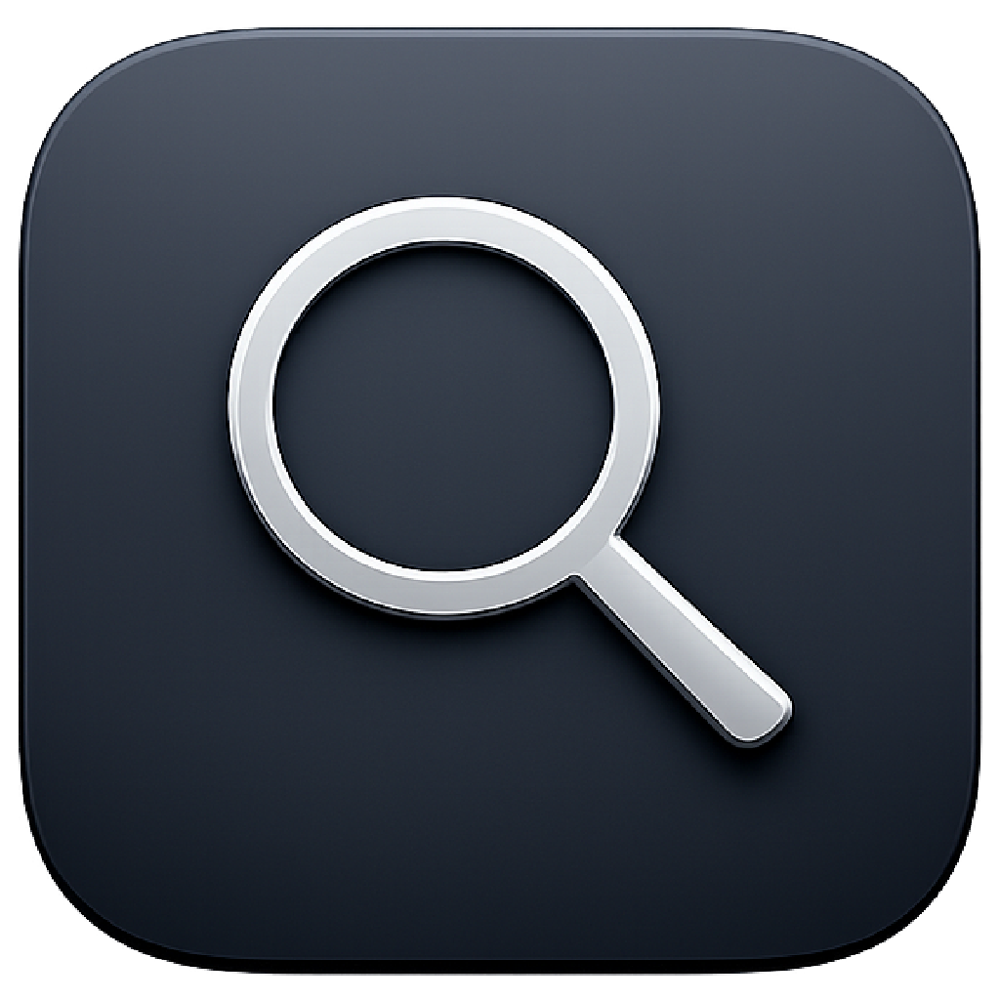
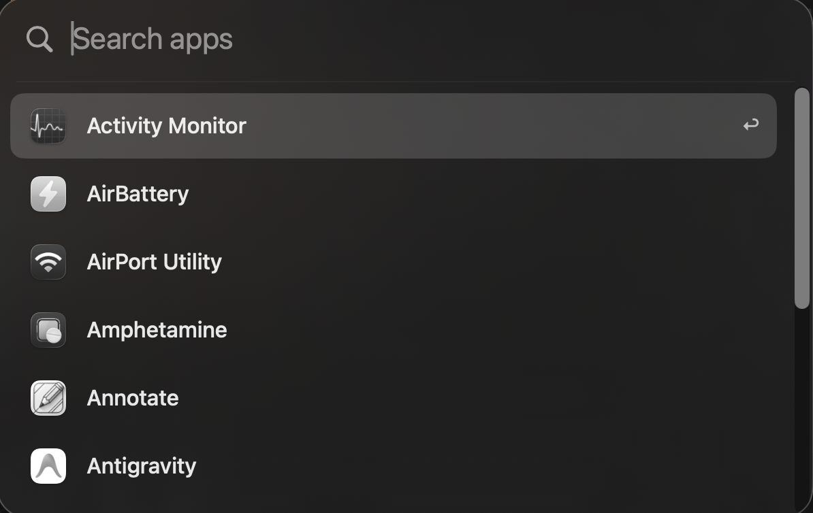

<p align="center">
  
</p>

<h1 align="center">Better Spotlight</h1>

<p align="center">
  <b>A launcher that just opens your apps.</b><br>
  No web results. No definitions. No unit conversions. No ads for things you didn't ask about.
</p>

<p align="center">
  <a href="https://github.com/charanjit-singh/Better-Spotlight/releases/latest"><b>Download for macOS</b></a>
  &nbsp;·&nbsp;
  <a href="#how-its-built">How it's built</a>
  &nbsp;·&nbsp;
  <a href="#replacing-spotlight-with-space">Replace ⌘Space</a>
</p>

<p align="center">
  
  
  
  
</p>

<p align="center">
  
</p>

---

## Why this exists

On August 10, 2026, [@heyimgustavo](https://x.com/heyimgustavo/status/2086816084280111322) posted a video with three words:

> **bring steve back** 😭

I replied without thinking much of it:

> **Someone please make a simple "app searxh" and please make it free**
>
> — [@cjsingg](https://x.com/cjsingg/status/2086882646781776144)

Then it kept bugging me. Spotlight used to be a box you typed three letters into to open an app. Now it answers questions nobody asked: web suggestions, dictionary definitions, unit conversions, App Store results. Every one of those is another thing that can outrank the app you were actually reaching for, which is how you end up typing a name you know by heart and still having to look at the screen to check what got selected.

The thing I wanted was a text field that opens apps. That's it. So rather than wait for someone else to build it, I built it that same night and put it here for free.

## What it does

- **Apps only.** Nothing else competes for the top result, so the first hit is always the thing you meant.
- **Learns what you use.** Real frecency ranking: frequency and recency combined, with a 14-day half-life. Type `s` and you get the app you open every morning, not the alphabetically luckiest one.
- **Opens instantly.** Your app list is scanned once and cached to disk. Pressing the shortcut never touches your filesystem.
- **Takes over ⌘Space.** Or `⌥Space`, `⌃Space`, `⌘⌥Space`, whichever you prefer. There's a guided setup for stealing `⌘Space` back from Spotlight.
- **Follows your cursor.** Opens centered on whichever display your mouse is on, not always the "main" one.
- **Always ready.** Registers itself as a login item so the shortcut works from the moment you log in.
- **Invisible until called.** No Dock icon. No menu bar icon unless you ask for one.

### What it deliberately doesn't do

No web search, no calculator, no file search, no clipboard history, no plugin system, no marketplace, no accounts, no telemetry, no update nagging. Those all exist elsewhere. This opens apps.

## Install

1. Grab the latest `BetterSpotlight-X.Y.Z.zip` from [Releases](https://github.com/charanjit-singh/Better-Spotlight/releases/latest)
2. Unzip and drag **Better Spotlight.app** to `/Applications`
3. Clear the download quarantine, because these builds aren't notarized yet:

```bash
xattr -dr com.apple.quarantine "/Applications/Better Spotlight.app"
```

4. Open it. A short welcome scans your apps, then hands you to Settings to pick a shortcut

If you skip step 3, macOS says *"Apple could not verify Better Spotlight is free of malware."* That's Gatekeeper reacting to the missing notarization, not to anything the app does. [How to get past it either way.](#apple-could-not-verify-better-spotlight)

**Requirements:** macOS 26.5 or later. Universal (Apple Silicon + Intel).

### Or build it yourself

```bash
git clone https://github.com/charanjit-singh/Better-Spotlight.git
cd Better-Spotlight
open "Better Spotlight.xcodeproj"   # then press ⌘R
```

Needs Xcode 26 or later. No package resolution, no `pod install`, no setup script. It builds.

## Using it

| Action | Key |
| --- | --- |
| Open / close | Your shortcut (pressing it again hides) |
| Move selection | `↑` `↓` |
| Launch selected | `↩` |
| Dismiss | `Esc`, or click outside |

Search for **Better Spotlight Settings** in the launcher itself to open preferences. You can also turn on the menu bar icon in Settings → Appearance, or just double-click the app in Finder.

## Replacing Spotlight with ⌘Space

Pick **Command + Space** in Settings and the two setup steps appear inline underneath it:

1. **Free the shortcut.** System Settings → Keyboard → Keyboard Shortcuts → Spotlight → uncheck *Show Spotlight search*.
2. **Grant Accessibility.** System Settings → Privacy & Security → Accessibility → enable Better Spotlight.

Both steps have buttons that jump straight to the right settings pane, and Settings shows live hotkey status so you can confirm it actually registered. The other shortcut presets work immediately and need neither step.

Why Accessibility is required for `⌘Space` and nothing else is the most interesting bug in this project, explained in [The ⌘Space problem](#the-space-problem).

## How it's built

16 Swift files, about 2,400 lines, zero third-party dependencies. SwiftUI for the interface, AppKit for everything macOS won't let SwiftUI do.

### The launcher window

It's a borderless `NSPanel` hosting a SwiftUI view, not a normal window. It sits at the assistive-technology window level so it floats above full-screen apps, joins every Space, and can take keyboard focus (`canBecomeKey`) while refusing to become the main window (`canBecomeMain`), so the app you were working in doesn't visibly lose its place. Window animations are switched off entirely, because a launcher that fades is a launcher that feels slow.

Showing it computes the frame from `NSEvent.mouseLocation` and picks the screen containing the cursor, so it lands on the display you're already looking at.

### Ranking

Every launch is recorded, and each app's score is a sum of exponentially decayed launch events:

```
score = 10 · Σ 0.5^(days_ago / 14)      // decaying launch events
      + log₂(lifetime_launches + 1)     // floor so old favorites survive
      + 1 / (1 + hours_since / 24)      // tie-breaker toward fresher
```

The half-life means an app you used constantly last month quietly yields to the one you're using this week, without ever fully disappearing. History for apps you uninstall is pruned automatically, both on scan and by checking whether bundles still exist on disk.

### The ⌘Space problem

The genuinely annoying discovery. Registering a global hotkey on macOS is `RegisterEventHotKey`, and for `⌥Space` that's the end of it. But for `⌘Space`, Carbon returns `noErr` as if it succeeded and then **never delivers the event**, because the system holds that combination for Spotlight even after you disable it in System Settings.

So `⌘Space` needs a second mechanism: a `CGEvent` tap inserted at the head of the session event stream, which requires Accessibility permission, matches the keypress itself, and swallows it so nothing downstream reacts. Both paths can fire for one physical keypress, so presses are de-duplicated with an 80ms window. `⌥Space` also stays registered as an escape hatch, which is how you get back into Settings if a shortcut experiment goes wrong.

### Scanning

Only the standard application directories are walked (`/Applications`, `/System/Applications`, the Cryptexes path where Apple hides Safari, and your user Applications folder), skipping descendants as soon as a `.app` is found so helper bundles nested inside apps don't pollute results. The scan runs off the main thread and reports progress; the result is cached as JSON, so this happens on first run and then only when you ask.

Icons are the expensive part of a launcher, so they're loaded lazily, downscaled to 32pt, capped at 40 in memory, and thrown away when the panel hides.

### Privacy

There is no networking code in this app. Not disabled, not opt-out: `URLSession` doesn't appear anywhere in the source. Two JSON files in `~/Library/Application Support/Better Spotlight/` hold your app list and launch counts, and nothing leaves your machine.

## Refreshing the app list

The catalog lives at `~/Library/Application Support/Better Spotlight/apps.json` and refreshes when:

- You click **Refresh Apps** in Settings (or in the menu bar menu)
- A result fails to launch because the app was moved or deleted, which triggers a rescan automatically

Install something new and it appears after a refresh. Launch history sits beside it in `usage.json`.

## Development

### Replay the first-run flow

```bash
./scripts/reset-first-run.sh                # also clears launch history
./scripts/reset-first-run.sh --keep-usage
```

Stop the app in Xcode (⌘.) before resetting, then Run (⌘R) after. If it's still running, macOS can write your old preferences back over the reset.

### Versioning

[SemVer](https://semver.org), with `VERSION` as the single source of truth:

```bash
./scripts/set-version.sh 1.2.0   # updates VERSION + Xcode MARKETING_VERSION
```

Then move your notes in `CHANGELOG.md` from `[Unreleased]` into `## [1.2.0] - YYYY-MM-DD`.

### Cut a release

```bash
./scripts/set-version.sh 1.2.0
git add VERSION CHANGELOG.md "Better Spotlight.xcodeproj/project.pbxproj"
git commit -m "Release v1.2.0"
git push
git tag v1.2.0 && git push origin v1.2.0
```

Pushing the tag triggers [`release.yml`](.github/workflows/release.yml), which builds a Release `.app` on a macOS 26 runner, zips it, extracts the matching changelog section as release notes, and publishes the zip plus its SHA-256 to GitHub Releases. `ci.yml` builds every push to `main`.

For a local zip without CI: `./scripts/build-release.sh`.

## "Apple could not verify Better Spotlight"

Release builds are **ad-hoc signed**, not notarized, so Gatekeeper blocks them on first launch with:

> Apple could not verify "Better Spotlight" is free of malware that may harm your Mac or compromise your privacy.

The signature itself is valid and the binary is exactly what [`release.yml`](.github/workflows/release.yml) built from this source. What's missing is a `$99/year` Apple Developer account to notarize it with. Two ways past it:

**Clear the quarantine flag** (fastest). Your browser tags every download with `com.apple.quarantine`, and that tag is what triggers the check:

```bash
xattr -dr com.apple.quarantine "/Applications/Better Spotlight.app"
```

**Or approve it in System Settings.** Note that right-clicking → Open no longer works; Apple removed that bypass in macOS 15.

1. Try to open the app, then click **Done** (not *Move to Trash*)
2. System Settings → Privacy & Security, scroll to **Security**
3. Click **Open Anyway** next to the message about Better Spotlight, then confirm and authenticate

The button only appears after you've attempted to open the app, and it expires about an hour later. Verify the download first if you like: the release page publishes a `.sha256` next to the zip, and `shasum -a 256 -c BetterSpotlight-*.zip.sha256` checks it.

### Notarizing properly

If you want to ship this without the warning:

1. Join the [Apple Developer Program](https://developer.apple.com/programs/)
2. Archive with **Developer ID Application** signing
3. Notarize with `xcrun notarytool` and staple the ticket
4. Ship the notarized zip or DMG

### Login items

Login items are more reliable from an installed `.app` than from an Xcode build. If Settings says *Waiting for approval*, enable Better Spotlight under System Settings → General → Login Items.

## License

Add a `LICENSE` file before making this repo public. MIT keeps it as free as the tweet asked for.
